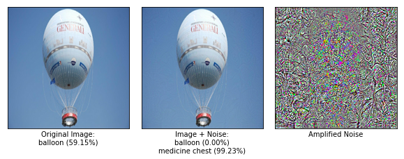
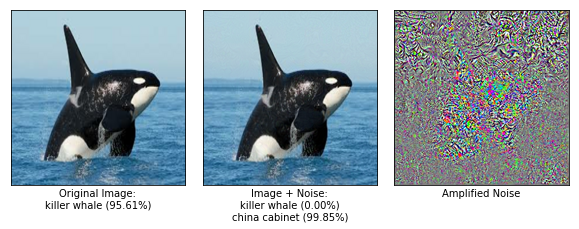
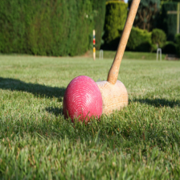
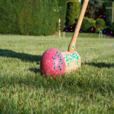
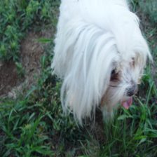
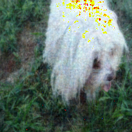
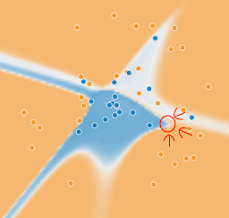
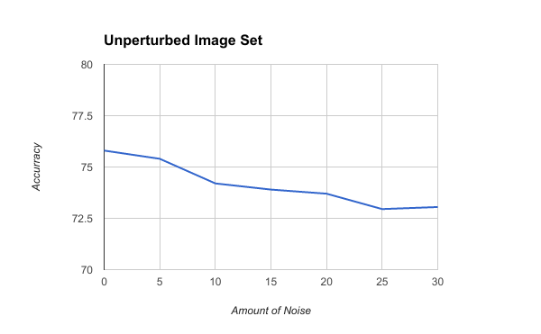
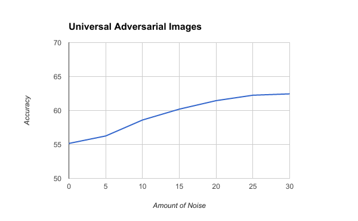
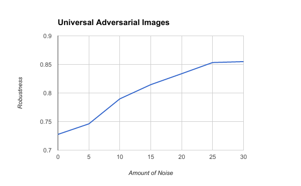

# **Project Charter**

### Project Overview

  Deep learning has recently contributed to learning state-of-the-art representations in service of various image recognition
tasks. Deep learning uses cascades of many layers of nonlinear processing units for feature extraction and transformation. Recently, researchers have shown that deep learning architectures are particularly vulnerable to adversarial examples, inputs to machine learning models intentionally designed to cause the model to make a mistake (Goodfellow et al 2014). In this paper, we propose three methods for increasing the robustness of deep learning architectures against adversarial examples. Specifically, we propose a biologically inspired multi-task learning (MTL) model, a downsampling model, and a model trained on images created by the generator from a generative adversarial network. Our results show that using these models improve adversarial robustness against universal adversarial perturbations (Moosavi-Dezfooli et al 2016). Additionally, we present a metric for adversarial robustness and provide extensive analysis on how adversarial images are represented in image vector space. 

### Project Approach

  Adversarial images and adversarial inputs in general have been the subject of a number of papers. What causes adversarial images? How are they generated? Are certain networks more resilient to adversarial images than others and if so what does it mean to be resilient and how can we measure a networks resilience? The project aims to answer the questions what does it mean to be an adversarial input, how can we make a network more resilient to adversarial images, and how do we measure resilience. Measuring resilience in a closed form would involve mapping the classification spaces of a network, which may be possible but is out of the scope of our project. Instead we intend to develop a method for comparing the resilience of two networks. This would give us the ability to measure the effectiveness of our techniques for improving the resilience of a network. We intend to run experiments where we train two networks, one network that uses one of our proposed methods for increasing resilience and one standard network as a control. We can then compare the resilience of the two networks and if our modified networks is more resilient than the control we can backup or claim that this method improves resilience. 

### Project Goals (High Level)

* To develop a method for measuring the robustness of a neural network against adversarial images.

* To determine if the discriminator of a GAN can detect adversarial inputs.

* To determine if downsampling improves the robustness of a network

* To determine if multi-task learning increases the robustness of a network

### Risks and How to Avoid Them

    1. Risk - Our metric for adversarial robustness only measures robustness against a certain type of adversarial image. 

    2. Mitigation - Define what we mean by robustness and prove that our metric actually measure that quality either absolutely or relative to other networks.    

    3. Risk - Writing code will take longer than expected.

    4. Mitigation - have modular goals that can be accomplished one by one. If we don’t try out all of our methods for improving robustness we will still have meaningful results.

    5. Risk - The more experienced member of the team may start to resent the less experienced member of the team because they are contributing less to project. 

    6. Mitigation - Talk about realistic expectations for each team member

    7. Risk - The more experienced member of the team may not trust the less experienced member of the team and thus avoid delegating responsibilities to them. This could waste a valuable human resource and make the less experience team member feel under appreciated.

    8. Mitigation - The more experienced team member should trust the less experienced team member initial until they have a working track record. 

    9. Risk - Our method for comparing the robustness of two networks involves finding adversarial images that are adversarial to one network but not adversarial to the other. This may prove difficult than we anticipate. 

    10. Mitigation - If cannot adversarial images prove more universal than we expect that is worthy talking about in and of itself.

# Group Management

  The team works together after class and has weekly meetings with the project advisor Alric Althoff. Because of exploratory nature of the project the development roles will continue to change throughout the quarter. We continue to come up with different ideas for how improve the robustness of a neural network. Individual team members will work on specific ideas. Each team will have autonomy when working on their own idea, but before an idea is pursued it will be questioned by the rest of the group. 

# Project Development

  The project uses python and TensorFlow along with a variety of small open source software packages that be found on our requirements.txt file. We also make use of an AWS GPU for additional computational resources. None of the code requires the use of a GPU, but it does speed up the experiments. All of the code can be found on the project GitHub repository along with instructions on how to run it and how to replicate our experiments. 

# Project Schedule

### Milestones

<table>
  <tr>
    <td>Description / How will you demonstrate completion</td>
    <td>Due</td>
    <td>Person Responsible</td>
    <td>Priority</td>
  </tr>
  <tr>
    <td>Write Inception Net. Report network accuracy on test set with visualizations of network predictions. Post the code.</td>
    <td>Week 4</td>
    <td>Patrick</td>
    <td>Low</td>
  </tr>
  <tr>
    <td>Build pipeline for adding universal perturbations to a dataset. Show visualizations of the process.
</td>
    <td>Week 4</td>
    <td>Davis</td>
    <td>Medium</td>
  </tr>
  <tr>
    <td>Find a dataset to use for our experiments. Provide reasons for choosing the dataset. </td>
    <td>Week 5</td>
    <td>Patrick</td>
    <td>Medium</td>
  </tr>
  <tr>
    <td>Preprocess the dataset to fit properly within Inception Net framework. Post code.</td>
    <td>Week 5</td>
    <td>Davis</td>
    <td>Medium</td>
  </tr>
  <tr>
    <td>Generate Universal Adversarial Images using preprocessed dataset. Write code for getting accuracy of a pre-trained model given some input and labels. </td>
    <td>Week 6</td>
    <td>Patrick</td>
    <td>High</td>
  </tr>
  <tr>
    <td>Write the autoencoder, convolutional autoencoder, and PCA models. Create three datasets by running the adversarial images through the models to use as input for experiments. </td>
    <td>Week 6</td>
    <td>Davis</td>
    <td>Medium</td>
  </tr>
  <tr>
    <td>Run experiments on auto-encoder, convolutional auto-encoder, and pca models and report accuracy using Patrick's tester code. Write the MTL model. </td>
    <td>Week 7</td>
    <td>Davis</td>
    <td>Medium</td>
  </tr>
  <tr>
    <td>Formalize method for measuring adversarial robustness. Work on digesting mathematical formalization of our methods of increasing adversarial robustness.</td>
    <td>Week 8</td>
    <td>Patrick</td>
    <td>Medium</td>
  </tr>
  <tr>
    <td>Run experiments to see if multi-task learning improves a networks robustness. Report accuracy. </td>
    <td>Week 8</td>
    <td>Davis</td>
    <td>Medium</td>
  </tr>
  <tr>
    <td> REPORT WORK: See how well these techniques generalize across datasets and across network architectures. Report the results of the experiments done on other networks and other datasets.</td>
    <td>Week 9</td>
    <td>Patrick and Davis</td>
    <td>Medium</td>
  </tr>

  <tr>
    <td>Finalize Video Presentation Stuff.</td>
    <td>Week 10</td>
    <td>Patrick and Davis</td>
    <td>High</td>
  </tr>

</table>

# Deliverables

### Build a Control Model 

We decided to use a pre-trained convolutional neural network. We use the [inception v3 network](https://github.com/tensorflow/models/tree/master/inception) provided by tensorflow. Below is a visiualization of the inception v3 architecture

The inception v3 network allows us to generate high resolution adversarail images. 

##### Accuracy of Control Model
Accuracy: 75.85%

### Choose a Dataset

We will be using a subset of the validation set of the 2012 Large Scale Visual Recognition Challenge hosted by [Imagenet](http://www.image-net.org/challenges/LSVRC/2012/nonpub-downloads).
The original validation set contains 50,000 images across 1,000 different categories. We reduced this to 2,000 images with 2 images form each category. Below are some examples of the images from the data set.

Label: Coral               |  Label: Jelly Fish        | Label:  Loom
:-------------------------:|:-------------------------:|:------------------:
  |   | 

### Use Adversarial Filters to Generate a Dataset of Adversarial Images

One method of generating adversarial images is to apply a universal adversarial perturbation. Universal adversarial perturbations are filters which can be applied to an image to convert it into a adversial image which gets misclassified by the vast majority of networks. We took our original data of images and added one of the 6 universal filter to each of the images. We will use this dataset as one of our benchmarks for robustness. A weak network will get roughly random accuracy on the universal adversarial image data set but a network with 10% accuracy will have a ceratain level of certification, a network with 20%  accuracy will have an even higher level of certification and so on. Below are the visualizations of the universal perturbations. 

##### Accuracy of Control Model on Univerasl Adversarial Images
Accuracy: 55.25%

### Use Gradient Ascent to Generate a Dataset of Adversarial Images

Another method of generating adversarial images is to choose a certain label that you want your images to be categorized as. For example you might want an image of a cat to be classified as a paper towel. We use gradient ascent to generate the approriate noise, so that when we add the noise to the original image it becomes an adversarial image. We took our original data set of images and for each image we chose another category at random and computed the noise necessary to make our original image be classified as the randomnly selected category. We will generate one of these gradient adversarial datasets for each of the models we create. We have a gradient adversarial dataset for our control inception v3 network, a gradient adversarial dataset for our inception v3 network with an added autoencoder layer, and a gradient adversarial dataset for our multiclass learning network. These data sets will be used to establish a relative measure of robustness. We will test the control network on the autoencoders adversarial dataset, and the autoencoder on the controls dataset. If the autoencoder has a higher accuracy rate then the autoencoder is considered more robust than the control. Eventually we will have standardized set of networks, each with their own established level of robustness. When a customer or boss asks about the robustness of your network you can say it has level four robustness because it is more robust than the forth network in the benchmark suit. 
Below are some examples of adversarial images generate using gradient ascent. 

##### Accuracy of Control Model on Gradient Adversarial Images
Accuracy: 57.55%

### Build a Modified Inception Network Which Does PCA Pre-Processing

##### Motivation
PCA (Principal Component Analysis) is used to reduce the dimensionality of a matrix. Adversarial images rely on adding specificallt targeted noise to an image. By pre-processing the inputs to a network using PCA we hope to remove the adversarial noise from our input images. This is one of our proposed methods for increasing the robustness of a network. Below our some examples of original images along with the PCA version of those images.

Original              |  PCA Verion with 99% of Varience       
:-------------------------:|:-------------------------:
  |   

Original              |  PCA Verion with 99% of Varience       
:-------------------------:|:-------------------------:
  |   

##### Accuracy After Doing PCA
Accuracy on original images: 23.35%

Accuracy on universal adversarial images: 22.10%
Universal Robustness : 0.9465

### Build a Modified Inception Network Which Adds Random Noise Before Classifying

##### Motivation
Adversarial Images add minor variations to the image's pixel values to push the image as quickly as possible to a different classification space (for example an image could be pushed from the dog classification space to the cat classification space). To prevent the adversarial perturbations from altering a human's perception of the image, the perturbations must remain small (changing each pixel by less than 5). Adding random noise to the image before classification causes the image to make random move in classification space. Adversarial images tend to exist in the sharp protrusions of a classification space so moving by moving randomnly we are more likely to move back into the correct category than to move further away. See the following diagrams for a visiualization. 

Take a simplified example of a classifier that takes two inputs – height and average number of seeds – and uses that to classify a plant as an orchid or not an orchid. Here an orchid is represented as blue and a not orchid is represented as orange. 

With a deep enough network and noisy enough data you could get the following abnormal classification space: 

The point circled in red is the closet blue area to the surrounding orange area, so many adversarial examples would be drawn to that point. Adversarial examples look for the shortest distance they have to travel to be classified as the other category. However if were to move in a random direction from that point we are more likely to return to the orange category than to move further into the blue space. This is the rational behind adding random noise. However, by the bigger step we take in a random direction the more likely we are to move into another classification space. Especially when we have many different categories. We did a grid search to find the ideal trade off between an increase in adversarial robustness and a loss in accuracy. 

##### Accuracy and Robustness After Adding Random Noise
Accuracy of Noisy Models on Original Images | 
:-------------------------:|
  |

Accuracy of Noisy Models on Universal Adversarial Images | Robustness of Noisy Models on Universal Adversarial Images |
:----------------------------------------:| :-----------------------------------------------:|
  |  |

Accuracy of Noisy Model on Gradient Adversarial Images of Control Model | Accuracy of Control Model on Gradient Adverarial Images of Noisy Model |
:--------------------------------:|:------------------------: |
Accuracy: 55.85% | Accuracy: ?????? |

### Build a Modified Inception Network Which Downsamples the Input Images

##### Motivation
Another way to reduce the dimesionality of the input images is to downsample. Downsampling reduces a 1,000 x 1,000 pixel image to some smaller n x n pixel image and then expands it back to a 1,000 x 1,000 pixel image again. This blurs the image which theorectically gets rid of the minor adversarial perturbations.

##### Accuracy

Downsampling by 50%                                | Downsampling by 75% |
:------------------------------------------------: | :-----------------: |
Accuracy on original images: 62.95%                | Accuracy on original images: 70.45% |
Accuracy on universal adversarial images: 54.30%   | Accuracy on universal adversarial images: 53.70% |
Robustness of Downsampling by 50% : 0.8625          | Robustness of Downsampling by 50% : 0.7622 |

  

